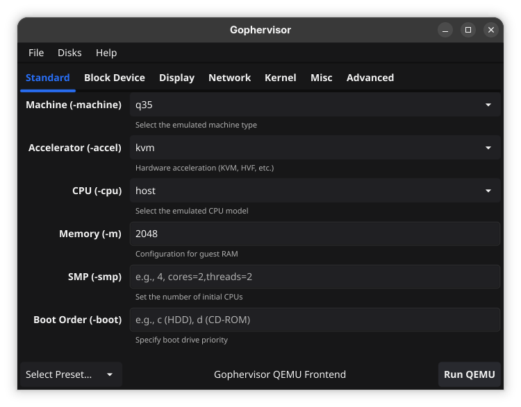
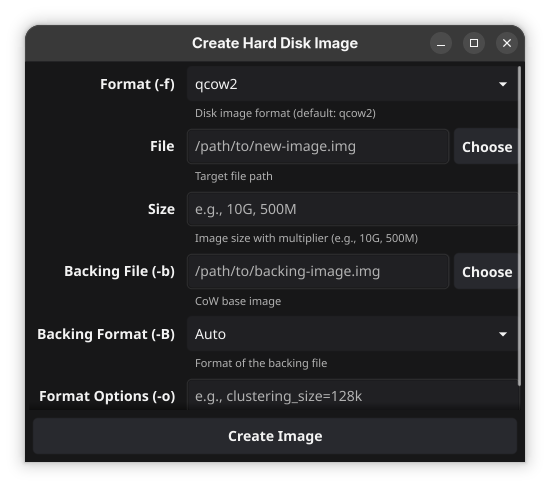

# Gophervisor

Gophervisor is a graphical frontend for the QEMU emulator/virtualization software, written in Go. It provides an interface to configure and launch virtual machines using `qemu-system-x86_64` and manage virtual hard disk images using `qemu-img`.

> NOTE: Only `qemu-system-x86_64` is supported for now, but support for other architectures may be added in the future. 
> NOTE (#2): Confirmed to work properly only on Linux (Ubuntu 25.10). Not sure if it works on other platforms. If you are facing any issues, please report them in the Issues section.

## Screenshots





## Installation

QEMU must be installed on your host system to utilize the full capabilities of Gophervisor.

To build Gophervisor from source, ensure you have the Go toolchain installed, and run:

```sh
go build -o gophervisor .
```

To start the application:

```sh
./gophervisor
```

## Libraries Used

- [Fyne](https://fyne.io/): A cross-platform UI toolkit and application API written in Go.

## License

This project is licensed under the Mozilla Public License 2.0. See [LICENSE](LICENSE) for more information.